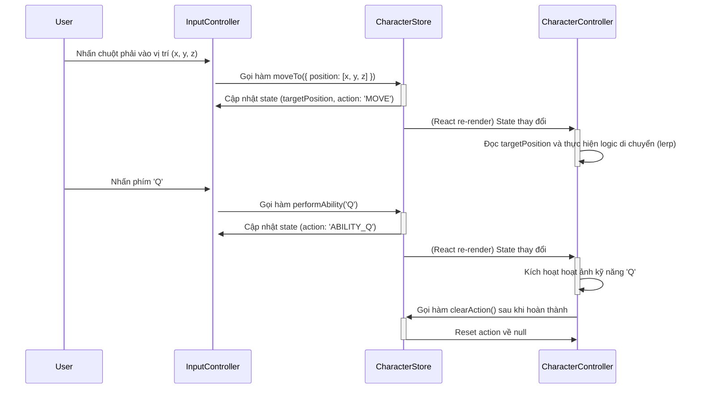

# Yasuo Three.js Meme Simulator Architecture Document

## Introduction / Preamble

Tài liệu này phác thảo kiến trúc kỹ thuật tổng thể cho dự án "Yasuo Three.js Meme Simulator". Vì dự án này chủ yếu tập trung vào frontend, tài liệu này sẽ tích hợp và chi tiết hóa các quyết định từ tài liệu Kiến trúc Frontend đã được tạo trước đó, đóng vai trò là nguồn thông tin kỹ thuật trung tâm. Mục tiêu chính là cung cấp một bản thiết kế rõ ràng cho việc phát triển sử dụng AI, đảm bảo tính nhất quán và tuân thủ các mẫu và công nghệ đã chọn.

## Technical Summary

Kiến trúc này được thiết kế cho một ứng dụng web client-side, tập trung vào trải nghiệm 3D thời gian thực. Nó sử dụng framework **Next.js** làm nền tảng cấu trúc, với hệ sinh thái **React Three Fiber (R3F)** là trái tim của phần đồ họa. Trạng thái ứng dụng sẽ được quản lý bởi **Zustand**. Kiến trúc này ưu tiên hiệu suất, tính module và một quy trình phát triển nhanh chóng.

## High-Level Overview

Hệ thống được thiết kế như một **Ứng dụng Trang đơn (Single Page Application - SPA)** được host trong môi trường Next.js. Mặc dù không có nhiều trang, Next.js cung cấp một cấu trúc dự án vững chắc, khả năng tối ưu hóa hình ảnh và một hệ sinh thái mạnh mẽ. Toàn bộ tương tác chính diễn ra trong một thành phần Canvas 3D duy nhất, được quản lý bởi React Three Fiber.

Kiến trúc kho lưu trữ được đề xuất là **Monorepo**, cho phép chứa code frontend và bất kỳ dịch vụ backend (tùy chọn trong tương lai) nào trong cùng một nơi.

## Architectural / Design Patterns Adopted

- **Component-Based Architecture:** Tận dụng React và R3F, toàn bộ ứng dụng được xây dựng từ các thành phần (components) độc lập và có thể tái sử dụng.
- **State Management (Client-Side):** Sử dụng Zustand để quản lý trạng thái toàn cục một cách tối giản, tách biệt logic trạng thái khỏi các thành phần hiển thị.
- **Hook-Based Logic:** Các logic có thể tái sử dụng (ví dụ: xử lý đầu vào từ bàn phím/chuột) sẽ được đóng gói trong các custom React Hooks.

## Component View

Các thành phần chính được chia thành các khối logic để dễ quản lý:

- **`SceneContainer`:** Component cấp cao nhất chứa `<Canvas>` của R3F và tất cả các thực thể 3D.
- **`Environment`:** Chịu trách nhiệm thiết lập môi trường 3D, bao gồm ánh sáng, mặt đất, và có thể là sương mù hoặc skybox.
- **`CharacterController`:** Component logic chính, chịu trách nhiệm tải mô hình nhân vật, quản lý và kích hoạt các hoạt ảnh. Nó lấy dữ liệu từ `useCharacterStore` để thực hiện các hành động.
- **`InputController`:** Một component "vô hình" (không render gì) hoặc một custom hook, chịu trách nhiệm lắng nghe các sự kiện từ bàn phím và chuột, sau đó cập nhật `useCharacterStore`.
- **`Effects`:** Component chứa các hiệu ứng hậu xử lý (post-processing) của R3F như bloom, depth of field, để tăng chất lượng hình ảnh.

## Project Structure

Cấu trúc thư mục sẽ tuân theo các quy ước của Next.js App Router và được tổ chức theo chức năng.

```plaintext
src/
├── app/
│   ├── layout.tsx
│   └── page.tsx
├── components/
│   ├── ui/                   # Các component UI 2D (ví dụ: loading screen, overlays)
│   │   └── LoadingScreen.tsx
│   └── 3d/                   # Các component 3D cho R3F
│       ├── SceneContainer.tsx
│       ├── CharacterController.tsx
│       ├── Environment.tsx
│       └── Effects.tsx
├── hooks/
│   └── useInputController.ts # Hook quản lý tất cả đầu vào từ người dùng
├── stores/
│   └── useCharacterStore.ts  # Store của Zustand cho trạng thái nhân vật
├── lib/
│   └── constants.ts
└── public/
    └── models/
        └── yasuo-wheelchair.glb
```

## API Reference

**MVP không yêu cầu tương tác với bất kỳ API bên ngoài hoặc nội bộ nào.**

## Data Models

Các mô hình dữ liệu chính tồn tại ở phía client-side, được quản lý bởi Zustand.

#### `CharacterState` (trong `useCharacterStore.ts`)

- **Description:** Lưu trữ tất cả trạng thái động của nhân vật.
- **Schema / Interface Definition:**

  ```typescript
  export interface CharacterState {
    position: [number, number, number];
    rotation: [number, number, number];
    action: string | null; // e.g., 'Q_ATTACK', 'MOVE_TO_TARGET'
    targetPosition: [number, number, number] | null;

    // Actions
    performAbility: (ability: "Q" | "W" | "E" | "R" | "F" | "D") => void;
    moveTo: (position: [number, number, number]) => void;
    clearAction: () => void;
  }
  ```

## Core Workflow / Sequence Diagrams

**Luồng Tương tác Di chuyển và Kỹ năng**



## Definitive Tech Stack Selections

| Category             | Technology                  | Version / Details   | Description / Purpose                                            |
| :------------------- | :-------------------------- | :------------------ | :--------------------------------------------------------------- |
| **Languages**        | TypeScript                  | 5.x                 | Ngôn ngữ chính cho toàn bộ dự án.                                |
| **Runtime**          | Node.js                     | 20.x                | Môi trường để chạy Next.js.                                      |
| **Frameworks**       | React (Next.js)             | 18.x (Next.js 14.x) | Framework chính cho giao diện người dùng và cấu trúc dự án.      |
|                      | Three.js                    | latest              | Thư viện đồ họa 3D cốt lõi.                                      |
| **3D Ecosystem**     | @react-three/fiber          | latest              | Bộ render (renderer) của Three.js cho React.                     |
|                      | @react-three/drei           | latest              | Tập hợp các hàm tiện ích và component cho R3F.                   |
|                      | @react-three/postprocessing | latest              | Dành cho các hiệu ứng hậu xử lý.                                 |
| **State Management** | Zustand                     | latest              | Thư viện quản lý trạng thái client-side.                         |
| **Styling**          | Tailwind CSS                | latest              | Framework CSS cho các yếu tố UI 2D.                              |
| **Testing**          | Vitest / Jest               | latest              | Framework để kiểm thử đơn vị (Unit Test) cho các hooks và logic. |
|                      | Playwright                  | latest              | Framework để kiểm thử E2E (post-MVP).                            |
| **CI/CD**            | GitHub Actions              | N/A                 | Tự động hóa việc build và triển khai.                            |

## Infrastructure and Deployment Overview

- **Cloud Provider(s):** Vercel hoặc Netlify được khuyến nghị.
- **Deployment Strategy:** CI/CD tích hợp. Mỗi lần push lên nhánh `main` sẽ tự động build và triển khai phiên bản mới.
- **Environments:** Một môi trường production duy nhất là đủ cho MVP.
- **Rollback Strategy:** Sử dụng tính năng rollback của Vercel/Netlify để quay lại phiên bản triển khai trước đó nếu có lỗi.

## Error Handling Strategy

- **Model Loading:** Sử dụng component `<Suspense>` của React để hiển thị một màn hình tải (`LoadingScreen`) trong khi các tài sản 3D đang được tải. Nếu có lỗi tải, hiển thị một thông báo lỗi cho người dùng.
- **Runtime Errors:** Các lỗi runtime phía client sẽ được bắt bởi Error Boundary của React để tránh làm sập toàn bộ ứng dụng.

## Coding Standards

- **Style Guide & Linter:** Sử dụng **ESLint** và **Prettier** với các cấu hình tiêu chuẩn cho React/TypeScript để đảm bảo code nhất quán.
- **Naming Conventions:**
  - Components: `PascalCase`
  - Hooks: `useCamelCase`
  - Biến & Hàm: `camelCase`
- **File Structure:** Tuân thủ nghiêm ngặt cấu trúc thư mục đã được định nghĩa ở trên.
- **Type Safety:** Tận dụng tối đa TypeScript. Tránh sử dụng kiểu `any`.

## Overall Testing Strategy

- **Unit Tests:** Tập trung vào các custom hooks (ví dụ `useInputController`) và logic trong store Zustand. Sử dụng Vitest/Jest và React Testing Library.
- **Integration Tests:** Không cần thiết cho MVP.
- **End-to-End (E2E) Tests:** Sẽ được bổ sung sau MVP. Các kịch bản chính bao gồm: tải trang thành công, nhấn từng phím kỹ năng và xác nhận hoạt ảnh được phát.
- **Manual Testing:** Là phương pháp chính để xác thực MVP. Phải kiểm tra trên các trình duyệt Chrome, Firefox, và Edge phiên bản mới nhất.

## Security Best Practices

- **Dependency Security:** Sử dụng `npm audit` hoặc các công cụ tương tự (như Dependabot của GitHub) để kiểm tra các lỗ hổng trong các thư viện phụ thuộc.
- **Cross-Site Scripting (XSS):** React và JSX đã có cơ chế tự động thoát các chuỗi ký tự để chống XSS. Không sử dụng các thuộc tính như `dangerouslySetInnerHTML`.

## Change Log

| Change        | Date       | Version | Description                               | Author |
| :------------ | :--------- | :------ | :---------------------------------------- | :----- |
| Initial Draft | 2025-07-19 | 1.0     | First draft of the Architecture Document. | Fred   |
