# CashCanvas Architecture Document

## Introduction / Preamble

This document outlines the overall project architecture for **CashCanvas**, including backend systems, shared services, and non-UI specific concerns. Its primary goal is to serve as the guiding architectural blueprint for AI-driven development, ensuring consistency and adherence to chosen patterns and technologies.
**Relationship to Frontend Architecture:**
A separate Frontend Architecture Document details the frontend-specific design and MUST be used in conjunction with this document. Core technology stack choices documented herein are definitive for the entire project.

## Table of Contents

- Technical Summary
- High-Level Overview
- Architectural / Design Patterns Adopted
- Component View
- Project Structure
- API Reference
- Data Models
- Core Workflow / Sequence Diagrams
- Definitive Tech Stack Selections
- Infrastructure and Deployment Overview
- Error Handling Strategy
- Coding Standards
- Overall Testing Strategy
- Security Best Practices
- Key Reference Documents
- Change Log

---

## Technical Summary

The CashCanvas system is designed as a **monorepo** containing a **monolithic backend API** built with **NestJS** and a **cross-platform mobile application** built with **React Native**. The architecture prioritizes a clear separation of concerns, scalability, and a streamlined developer experience by using TypeScript across the entire stack. Data will be persisted in a **PostgreSQL** database. This approach provides a robust and efficient foundation for the MVP while allowing for future expansion.

---

## High-Level Overview

The architecture is a classic client-server model. The React Native mobile app acts as the client, communicating with the NestJS backend via a RESTful API. The backend handles all business logic, data persistence, and authentication. The project will be housed in a single monorepo to simplify dependency management and sharing of types and validation logic between the frontend and backend.


---

## Architectural / Design Patterns Adopted

- **Monorepo:** To manage frontend and backend code in a single repository, simplifying dependency management and code sharing (e.g., types).
- **Monolithic API:** For the MVP, a single backend service simplifies development and deployment. It can be broken down into microservices later if required.
- **Repository Pattern:** To abstract the data layer, making it easier to switch database technologies and simplifying testing.
- **Dependency Injection:** Leveraged heavily by the NestJS framework to manage dependencies and promote modular, testable code.

---

## Component View

The system consists of three major logical components: the mobile application, the backend API, and the database.

- **Mobile Application (React Native):** Responsible for all user interface rendering and user interaction. It is a "dumb" client that consumes the backend API for all data and business logic.
- **Backend API (NestJS):** The core of the system. It handles user authentication, transaction processing, data validation, and all business logic. It exposes a RESTful API for the mobile client.
- **Database (PostgreSQL):** The persistence layer. It stores all user data, transactions, goals, and other application data.

```mermaid
graph TD
    subgraph "User Device"
        MobileApp["📱<br>React Native App"]
    end

    subgraph "Cloud Infrastructure"
        BackendAPI["⚙️<br>NestJS Backend API"]
        Database["🗄️<br>PostgreSQL Database"]
    end

    MobileApp -->|HTTPS API Calls| BackendAPI
    BackendAPI -->|SQL Queries| Database
```

<!-- end list -->



---

## Project Structure

The project will use a monorepo structure managed by `pnpm` or `npm/yarn workspaces`.

```plaintext
cashcanvas-monorepo/
├── apps/
│   ├── api/                # NestJS backend application
│   │   ├── src/
│   │   ├── test/
│   │   ├── Dockerfile
│   │   └── package.json
│   └── mobile/             # React Native application
│       ├── src/
│       ├── ios/
│       ├── android/
│       └── package.json
├── packages/
│   ├── ui/                 # Shared React Native UI components
│   │   └── src/
│   ├── config/             # Shared configurations (ESLint, Prettier, etc.)
│   │   └── eslint-preset.js
│   └── types/              # Shared TypeScript types and interfaces
│       └── src/
├── package.json            # Root package.json for monorepo scripts
└── pnpm-workspace.yaml     # Or equivalent workspace config
```

---

## API Reference

### Internal APIs Provided

#### CashCanvas API

- **Base URL(s):** `/api/v1`

- **Authentication/Authorization:** JWT Bearer Token required for all protected endpoints.

- **`POST /api/v1/auth/signup`:**

  - Description: Registers a new user.
  - Request Body Schema: `{ "email": "string", "password": "string" }`
  - Success Response Schema (Code: `201 OK`): `{ "user": { "id": "uuid", "email": "string" }, "token": "jwt" }`

- **`POST /api/v1/auth/login`:**

  - Description: Authenticates a user and returns a JWT.
  - Request Body Schema: `{ "email": "string", "password": "string" }`
  - Success Response Schema (Code: `200 OK`): `{ "user": { "id": "uuid", "email": "string" }, "token": "jwt" }`

- **`POST /api/v1/transactions`:**

  - Description: Creates a new transaction for the authenticated user.
  - Request Body Schema: `{ "type": "INCOME" | "EXPENSE", "amount": "number", "category": "string", "description": "string", "date": "iso_string" }`
  - Success Response Schema (Code: `201 Created`): `{ transaction_object }`

- **`GET /api/v1/transactions`:**

  - Description: Retrieves a list of transactions for the authenticated user.
  - Success Response Schema (Code: `200 OK`): `[ { transaction_object }, ... ]`

---

## Data Models

### Core Application Entities

#### User

- **Description:** Represents an application user.
- **Schema / Interface Definition:**
  ```typescript
  export interface User {
    id: string; // uuid
    email: string;
    passwordHash: string; // Not exposed in API
    createdAt: Date;
  }
  ```

#### Transaction

- **Description:** Represents a single income or expense event.
- **Schema / Interface Definition:**
  ```typescript
  export interface Transaction {
    id: string; // uuid
    userId: string; // Foreign key to User
    type: "INCOME" | "EXPENSE";
    amount: number; // Stored as a decimal or integer (e.g., in cents)
    category: string;
    description: string;
    date: Date;
    createdAt: Date;
  }
  ```

### Database Schemas

#### users

- **Schema Definition:**
  ```sql
  CREATE TABLE users (
    id UUID PRIMARY KEY DEFAULT gen_random_uuid(),
    email VARCHAR(255) UNIQUE NOT NULL,
    password_hash VARCHAR(255) NOT NULL,
    created_at TIMESTAMPTZ NOT NULL DEFAULT NOW()
  );
  ```

#### transactions

- **Schema Definition:**

  ```sql
  CREATE TYPE transaction_type AS ENUM ('INCOME', 'EXPENSE');

  CREATE TABLE transactions (
    id UUID PRIMARY KEY DEFAULT gen_random_uuid(),
    user_id UUID NOT NULL REFERENCES users(id) ON DELETE CASCADE,
    type transaction_type NOT NULL,
    amount DECIMAL(12, 2) NOT NULL,
    category VARCHAR(100) NOT NULL,
    description TEXT,
    date TIMESTAMPTZ NOT NULL,
    created_at TIMESTAMPTZ NOT NULL DEFAULT NOW()
  );
  ```

---

## Definitive Tech Stack Selections

| Category           | Technology                   | Version / Details | Description / Purpose                          |
| :----------------- | :--------------------------- | :---------------- | :--------------------------------------------- |
| **Languages**      | TypeScript                   | `~5.x`            | Primary language for backend and frontend.     |
| **Runtime**        | Node.js                      | `~20.x LTS`       | Server-side execution environment for NestJS.  |
| **Frameworks**     | NestJS                       | `~10.x`           | Backend API framework.                         |
|                    | React Native                 | `~0.7x`           | Frontend mobile application framework.         |
| **Databases**      | PostgreSQL                   | `15`              | Primary relational data store.                 |
| **Infrastructure** | AWS CDK                      | `~2.x`            | Infrastructure as Code tool.                   |
|                    | Docker                       | `Latest`          | Containerization for local dev and deployment. |
| **Navigation**     | React Navigation             | `~6.x`            | Routing and navigation for React Native.       |
| **Testing**        | Jest                         | `~29.x`           | Unit/Integration testing framework.            |
|                    | React Native Testing Library | `Latest`          | Component testing for React Native.            |
|                    | Detox                        | `~20.x`           | End-to-end testing framework for mobile.       |
| **CI/CD**          | GitHub Actions               | `N/A`             | Continuous Integration/Deployment.             |

---

## Infrastructure and Deployment Overview

- **Cloud Provider(s):** AWS
- **Core Services Used:** Amazon RDS (for PostgreSQL), AWS Fargate/ECS (for NestJS container), Amazon S3 (for static assets), AWS CodePipeline/CodeBuild (if not using GitHub Actions exclusively).
- **Infrastructure as Code (IaC):** AWS CDK. Code located in `/infra` directory.
- **Deployment Strategy:** CI/CD pipeline triggered on push to `main` branch. The pipeline will build, test, and deploy the backend container to Fargate. Mobile releases will be managed via Fastlane and uploaded to App Store Connect / Google Play Console.
- **Rollback Strategy:** Automated rollback on health check failure post-deployment for the backend. App store releases are rolled back manually.

---

## Coding Standards

- **Style Guide & Linter:** ESLint with a shared preset in `packages/config`, plus Prettier for automatic formatting.
- **Naming Conventions:** `camelCase` for variables/functions, `PascalCase` for classes/types/components.
- **File Structure:** Adhere to the layout defined in the "Project Structure" section.
- **Asynchronous Operations:** Always use `async`/`await`.
- **Type Safety:** TypeScript strict mode must be enabled. The `any` type is forbidden.

---

## Overall Testing Strategy

- **Unit Tests:** To test individual functions and services in isolation. All business logic in NestJS services must be unit tested.
- **Integration Tests:** To test the interaction between API endpoints and the database. A test database will be spun up via Docker for these tests.
- **End-to-End (E2E) Tests:** To validate complete user flows using Detox, simulating real user interaction on the mobile app.

---

## Security Best Practices

- **Input Sanitization/Validation:** NestJS `class-validator` and `class-transformer` will be used for all DTOs at the API boundary.
- **Secrets Management:** Environment variables will be used for secrets, injected via the runtime environment (ECS Task Definition, local `.env` file). Never hardcode secrets.
- **Authentication/Authorization Checks:** JWTs will be validated by a Passport.js guard in NestJS on all protected endpoints.
- **Dependency Security:** Run `npm audit` or use `pnpm audit` in CI to check for vulnerable dependencies.

---

## Key Reference Documents

- Product Requirements Document (PRD)
- UI/UX Specification
- Frontend Architecture Document

---

## Change Log

| Change        | Date       | Version | Description                       | Author           |
| :------------ | :--------- | :------ | :-------------------------------- | :--------------- |
| Initial Draft | 2025-07-15 | 1.0     | First draft of main architecture. | Fred (Architect) |
