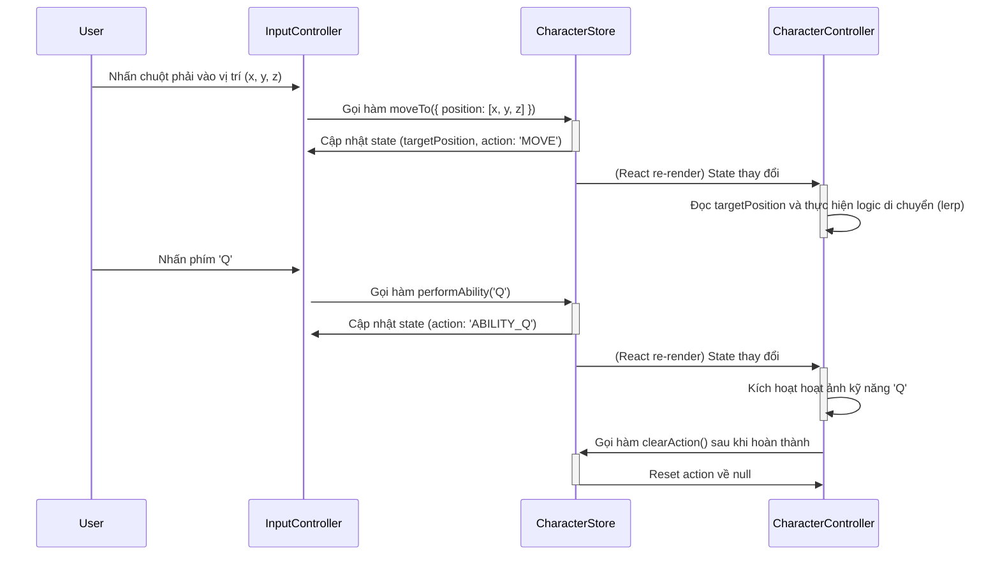

# Sequence Diagrams

> This document is a granulated shard from the main "Yasuo Three.js Meme Simulator Architecture Document" focusing on "Sequence Diagrams".

## Core Workflow / Sequence Diagrams

**Luồng Tương tác Di chuyển và Kỹ năng**

